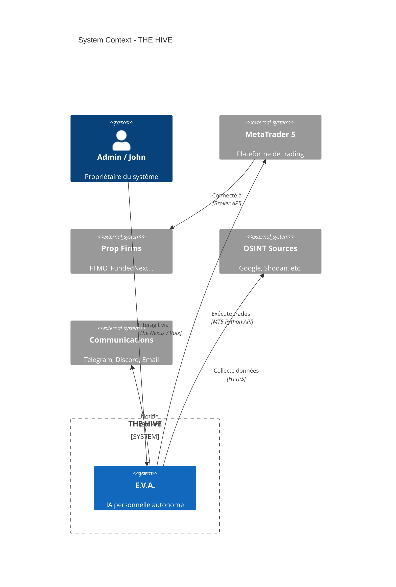
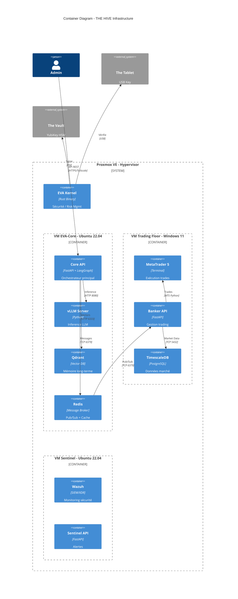
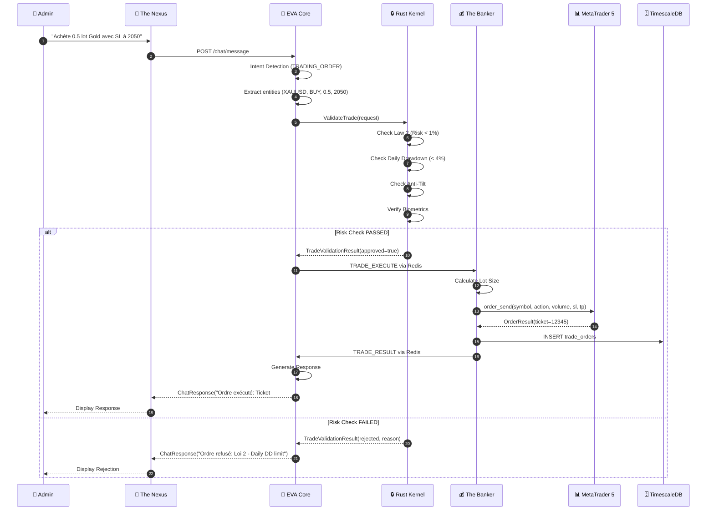
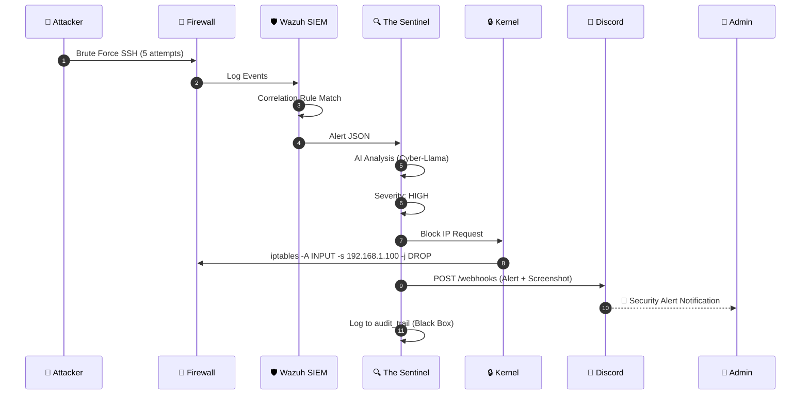
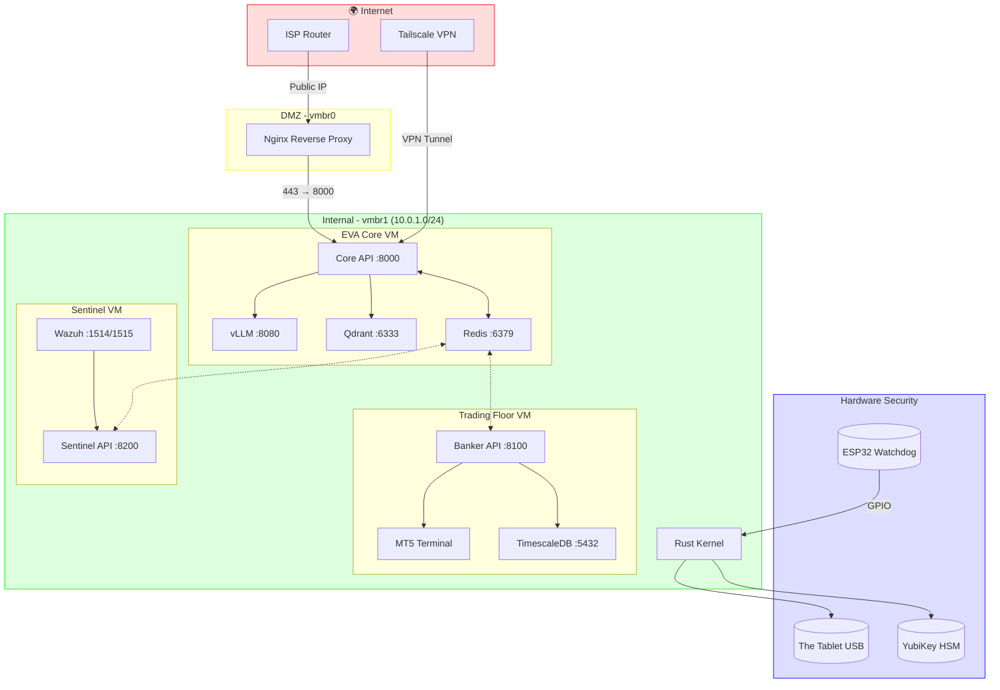
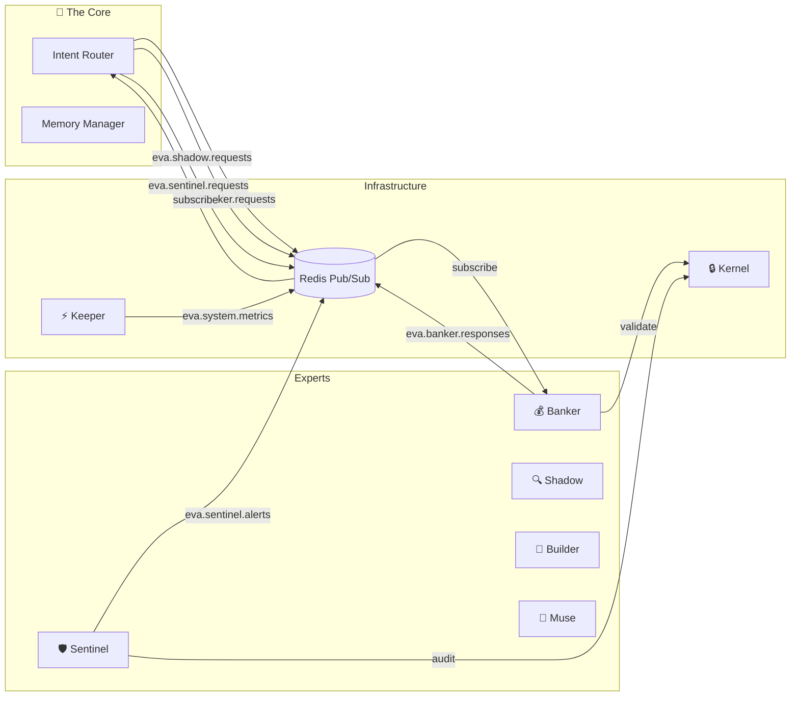
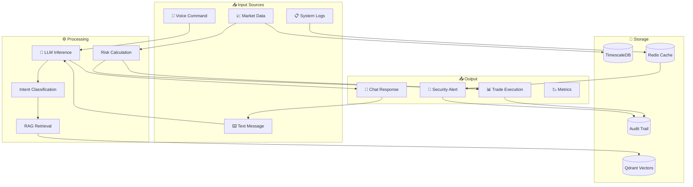
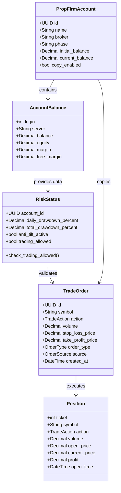
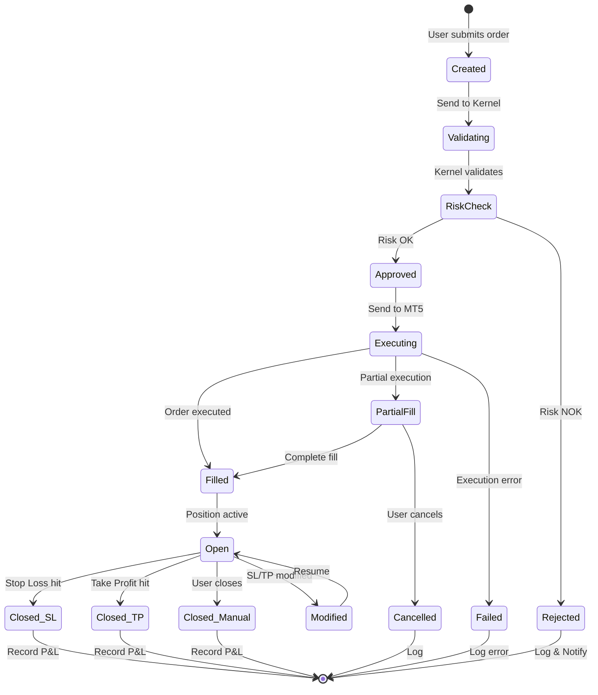

# Diagrammes d'Architecture THE HIVE

> **Version**: 1.0.0  
> **Format**: Mermaid

---

## 📐 C4 - Context Diagram

Vue d'ensemble du système et ses interactions externes.

---

## 📦 C4 - Container Diagram

Architecture des conteneurs/VMs du système.

---

## 🔄 Sequence - Trade Execution Flow

Flux complet d'exécution d'un ordre de trading.

---

## 🛡️ Sequence - Security Alert Flow

Flux de détection et réponse à une alerte sécurité.

---

## 🌐 Network Topology

Architecture réseau avec VLANs et flux.

---

## 🤖 Agent Communication

Flux de communication entre agents EVA.

---

## 🗃️ Data Flow

Flux des données à travers le système.

---

## 🏗️ Class Diagram - Trading Models

Structure des classes principales du module Trading.

---

## 📊 State Machine - Trade Lifecycle

États d'un ordre de trading.

