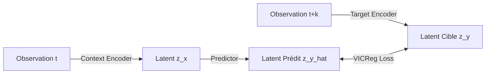

# ARCHITECTURE DE TRADING ANTI-FRAGILE — THE HIVE V4.0

Ce document sert de manuel de référence pour l'architecture système unifiée de **THE HIVE v4.0**, combinant l'apprentissage par renforcement profond (MuZero, DreamerV3), la modélisation sémantique auto-supervisée (Market-JEPA), l'intégration relationnelle (GNN), le stockage de séries temporelles (TimescaleDB) et la mémoire associative (HippoRAG 2).

---

## 1. La Philosophie Systémique de la v4.0

THE HIVE v4.0 vise à introduire des propriétés d'**anti-fragilité** et de **résilience absolue** face aux variations chaotiques des marchés financiers. Plutôt que de subir la dérive de distribution des prix bruts (*data drift*), le système opère à travers un double filtre :
1. Un filtre relationnel (**GNN**) qui modélise les corrélations structurelles entre tous les actifs de la flotte.
2. Un filtre sémantique auto-supervisé (**Market-JEPA**) qui projette les observations bruitées dans un espace latent ultra-stable et robuste.

---

## 2. Encodage Auto-Supervisé : Market-JEPA & Perte VICReg

Le composant `jepa_encoder.py` implémente en JAX/Haiku l'architecture **Market-JEPA (Joint Embedding Predictive Architecture)**. 

### Rôle et Fonctionnement :
* **Débruitage sémantique** : Contrairement aux auto-encodeurs classiques (qui reconstruisent les pixels ou les prix bruts, gaspillant de la capacité sur le bruit à haute fréquence), JEPA apprend à prédire les représentations latentes futures du marché directement dans l'espace latent.
* **VICReg Loss (Variance-Invariance-Covariance)** : Pour éviter que les réseaux ne subissent un effondrement des représentations (où tous les états convergent vers un vecteur nul ou constant), nous appliquons la perte VICReg :
  * **Invariance (similitude)** : Force la représentation prédite à être proche de la représentation cible réelle future.
  * **Variance** : Force l'écart-type de chaque dimension latente à rester au-dessus d'un seuil $\gamma = 1.0$, garantissant que chaque lot contient des informations diverses.
  * **Covariance** : Minimise les covariances croisées hors-diagonale pour décorréler les dimensions latentes et supprimer toute redondance.

---

## 3. Agent MuZero JAX & Modèle de Monde Conditionné

L'intégration au sein de l'agent MuZero JAX (`jax_agent.py` et `jax_networks.py`) s'effectue par injection directe :

* **Injection Dynamique de Poids** : Au démarrage de `JAXMuZeroAgent`, si `use_jepa_encoder = True` est activé, l'agent charge les paramètres du fichier `jepa_encoder_latest.pkl`. Les tenseurs Haiku sous le namespace `context_encoder/` sont automatiquement mappés et injectés dans les variables correspondantes du `RepresentationNetwork` de MuZero.
* **Stabilité du MCTS** : En travaillant dans l'espace latent stable et normalisé ($\tanh$) produit par le JEPA, les pas de dynamique recurrents de MuZero subissent beaucoup moins d'erreurs d'accumulation temporelle, ce qui accélère la convergence des simulations de l'arbre MCTS sous JIT.

---

## 4. Infrastructure de Données : Ingestion de Flotte Dédupliquée

L'alimentation de notre base de données et des pipelines de Shadow Learning repose sur l'ingestion automatisée multi-comptes (`mt5_history_pipeline.py`) :

* **Duplication Impossible** : Pour éviter toute distorsion statistique durant l'entraînement de MuZero, chaque trade importé est verrouillé via une clé unique composite :
  $$\text{position\_key} = \text{account\_key} : \text{position\_id}$$
  Cette clé est archivée dans un registre persistant `state.json`. Les positions déjà connues ne sont jamais ingérées deux fois.
* **TimescaleDB comme source de vérité** : Bien que le chargeur Eva-Lab (`load_history_frame`) intègre un repli silencieux vers les fichiers CSV sur disque, TimescaleDB (`timescale_store.py`) est notre stockage cible pour l'historique et les manifestes. Il fournit une isolation optimale des séries temporelles via son architecture d'hypertable compressée.

---

## 5. Diagnostic de HippoRAG 2 : La Mémoire Associative Non Exploitée

### Le Constat Actuel :
> [!WARNING]
> Actuellement, le module de mémoire associative de pointe **HippoRAG 2** (`MemoryBridge` & `GraphMemory` sur Neo4j) est **totalement découplé** de nos réseaux quantitatifs de Deep Learning (JEPA/MuZero). Il est cantonné au rôle d'assistant de recherche sémantique pour l'LLM de supervision (Eva-Core).

### Pourquoi est-ce sous-exploité ?
L'agent de trading prend des décisions en se basant uniquement sur des vecteurs d'indicateurs numériques locaux. Il n'a aucune conscience de la "mémoire à long terme" du système :
* Il ignore si le marché actuel présente une analogie historique avec une crise macroéconomique passée consignée dans le graphe de connaissances Neo4j.
* Il n'a aucun moyen de projeter une interrogation sémantique sous forme d'embedding de contexte pour guider sa prise de décision.

### Piste d'Unification (THE HIVE v5.0) :
Pour combler cette lacune, nous devons introduire le concept de **Conditionnement par Mémoire Graphique** :
1. Lors du self-play, l'agent extrait des triplets sémantiques ou de régime de marché de l'observation courante.
2. Il interroge HippoRAG 2 via une recherche hybride (PPR sur Neo4j) pour extraire les faits associés passés.
3. Ces relations sous forme de vecteurs d'embeddings de graphe de connaissances sont injectées en entrée de l'encodeur JEPA au même titre que les embeddings de structure GNN.
4. L'agent MuZero dispose ainsi d'une mémoire associative unifiée capable de surmonter la dérive de distribution.

---

## 6. Apprentissage Fictif (Fictitious Play) : AlphaStar League

Pour immuniser l'agent MuZero contre le surapprentissage sur ses propres trajectoires et éviter les cycles de comportement auto-destructeurs, nous avons implémenté l'**AlphaStar League** via un pool de trajectoires historiques :

* **LeagueBuffer (`league_buffer.py`)** : Gère la persistance sur disque et le chargement en mémoire des trajectoires issues des anciens champions et versions stables de référence (stockées sous `data/muzero/league/champion_<horizon>`).
* **Mélange Dynamique de Trajectoires** : Lors de la phase de préparation de lot (`prepare_training_step` dans `jax_agent.py`), nous mixons des trajectoires courantes avec des trajectoires de ligue selon un quota ajustable (par défaut `league_mix_ratio = 20%`).
* **Bypass de la SumTree de Replay** : Pour éviter que les priorités des trajectoires de la ligue ne viennent polluer ou corrompre la somme de l'arbre (`SumTree`) du replay buffer prioritaire, les lots issus de la ligue portent un index de feuille fictif de `-1.0`. La fonction de mise à jour des priorités (`update_priorities`) ignore silencieusement tout index inférieur à `capacity - 1`.

---

## 7. Scoring d'Arena Progressif & Conformité Prop-Firm

Pour se conformer aux exigences de gestion des risques des prop-firms institutionnelles (telles que FTMO et FTUK), l'évaluation dans l'Arena a été profondément repensée :

* **Abandon de la rigidité du 10%** : Auparavant, l'Arena récompensait de façon binaire un rendement quotidien supérieur à 10%. Ce comportement incitait l'agent à prendre des risques de levier excessifs, incompatibles avec les limites strictes de drawdown quotidien.
* **Fonction de Scoring Progressive Continue** :
  * La nouvelle fonction `_score_metrics` attribue un bonus de stretch progressif dès que le rendement quotidien maximal dépasse **1.0%** (`best_day_net_return_pct >= 1.0`).
  * La récompense est linéaire et continue (`+0.4` point par 1% de rendement quotidien maximal, plafonné à **4.0** points), combinée avec des points supplémentaires pour la régularité des pics.
  * L'agent est ainsi fortement encouragé à réaliser des profits réguliers de faible amplitude tout en minimisant le drawdown maximal évalué par l'Arena (facteur de pénalité de `-1.5 * max_drawdown_pct`).

---

## 8. Orchestration & Isolation Multi-GPU

Pour exploiter de manière optimale les deux GPU RTX 3090 du serveur sans risquer de conflits ou de dépassements de VRAM (Out of Memory - OOM) :

* **Séparation Stricte des GPU** :
  * **GPU 1** est dédié en continu à l'apprentissage en direct (Self-Play et entraînement MuZero JAX).
  * **GPU 0** est réservé aux entraînements secondaires hors-ligne (Market-JEPA, GNN, DreamerV3) et à l'inférence vLLM.
* **Orchestration de Weekend Stack (`run_weekend_stack.py`)** :
  * Les marchés financiers étant fermés le weekend, l'orchestrateur coupe silencieusement le service `vllm` sur GPU 0 pour libérer l'intégralité de sa VRAM.
  * Il lance ensuite séquentiellement un entraînement intensif de **500 époques du GNN** suivi de **3 000 époques de DreamerV3** sur GPU 0.
  * Cette séparation matérielle est garantie via l'environnement `CUDA_VISIBLE_DEVICES=0` et la désactivation de la pré-allocation VRAM de JAX (`XLA_PYTHON_CLIENT_PREALLOCATE=false`), préservant à 100% le processus d'apprentissage de GPU 1.
