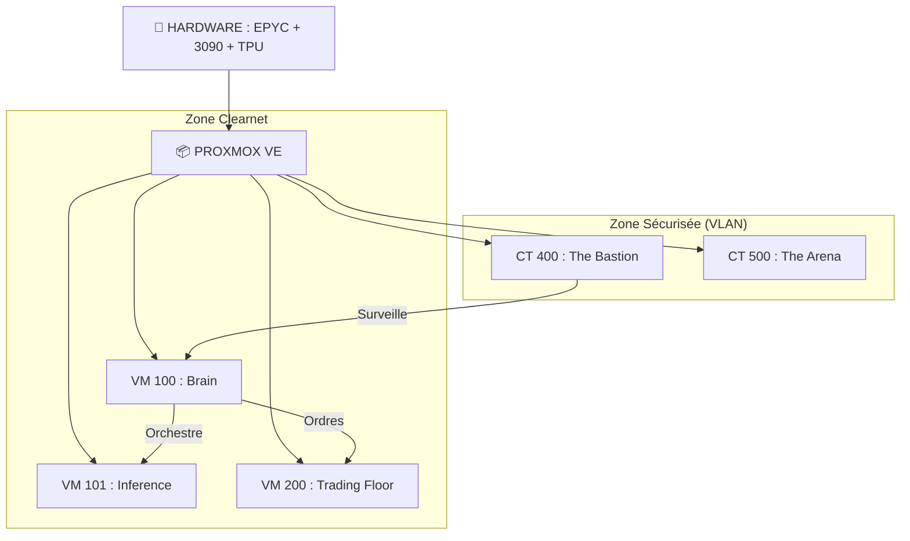
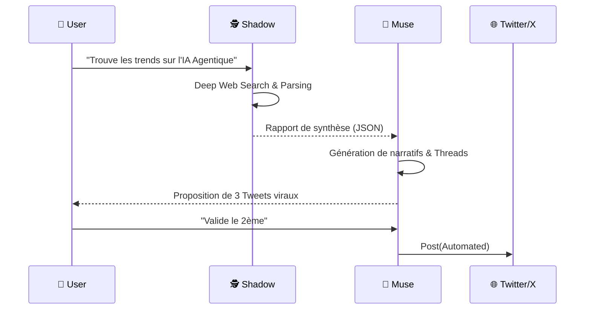
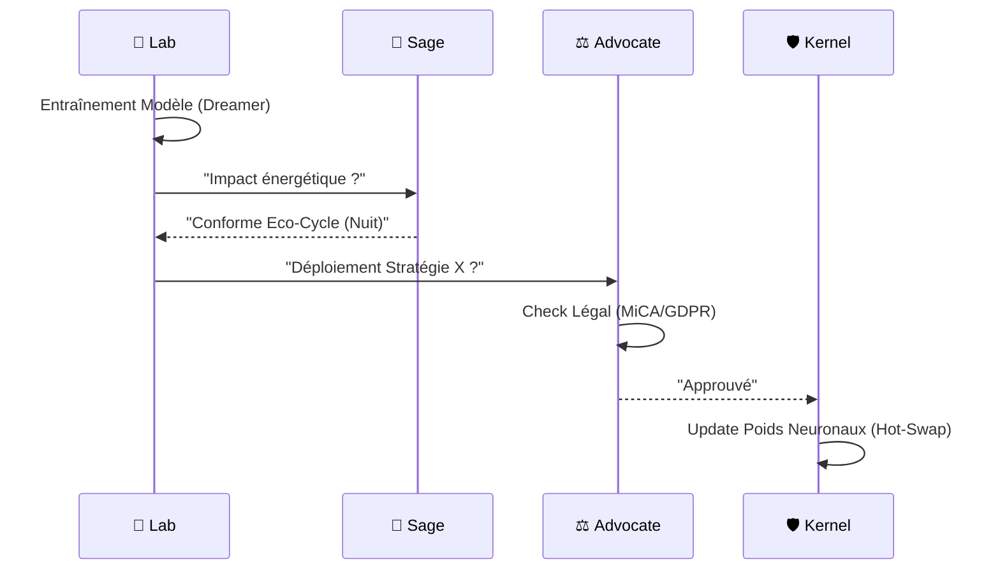
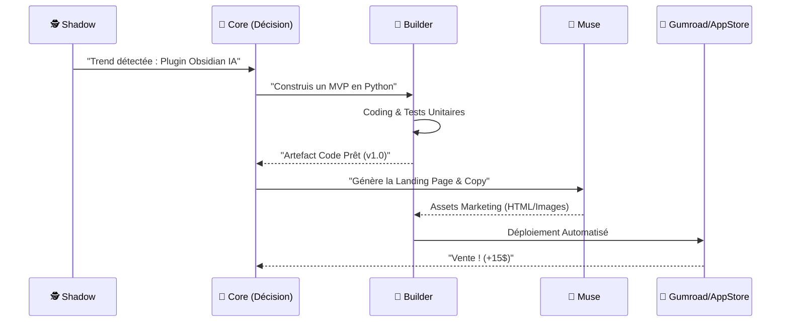
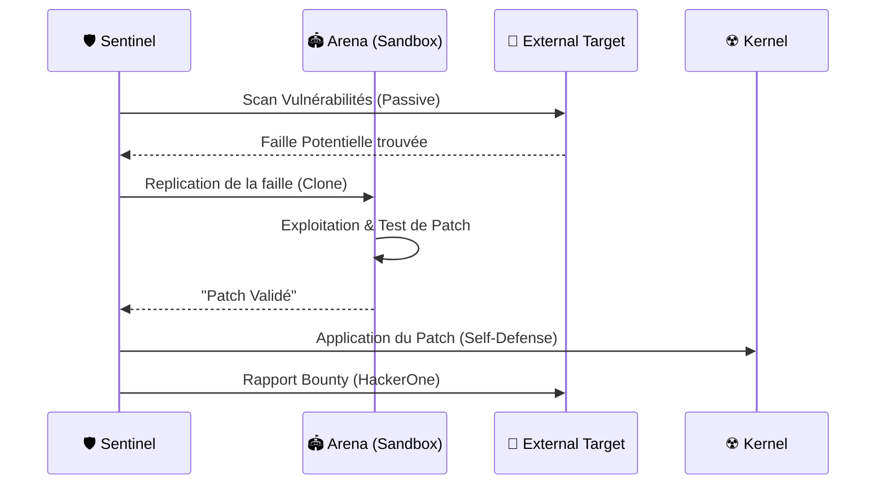

# 🐝 THE HIVE & E.V.A. : SPÉCIFICATIONS FONCTIONNELLES ET TECHNIQUES DÉTAILLÉES


> **"Un organisme numérique conçu pour une souveraineté financière, personnelle et architecturale absolue."**

---

## 1. 🌟 VISION ET CONCEPT GLOBAL

**THE HIVE** (La Ruche) est une infrastructure matérielle souveraine (Proxmox) fonctionnant comme une "Ruche Numérique" auto-suffisante.  
**E.V.A. (Evoluting Virtual Assistant)** est l'intelligence artificielle distribuée (MoE) qui habite cette ruche. Elle n'est pas un simple outil, mais un **Actif Évolutif** dont la mission est d'optimiser la vie, les finances et la sécurité de l'utilisateur, tout en contribuant positivement à la biosphère une fois l'abondance atteinte.

### 📜 PRINCIPES FONDATEURS "GENESIS" (Phase 0)
*   **Hardware Limité** : 1x GPU, RAM contrainte. Elle ne peut pas tout faire en même temps (Ordonnancement Strict).
*   **Aveugle** : Elle ne possède pas encore les lunettes Halo. Elle doit générer le profit nécessaire pour "gagner la vue".
*   **Capital : 20€** : Apport unique de l'utilisateur. E.V.A. utilise la *Code Factory* pour transformer ces 20€ en ~155€ (Challenge Prop Firm).
*   **La Dette de Naissance (-2 500 €)** : Le matériel initial (Serveur, GPU 3090, TPUs) est une dette. **Objectif Prioritaire** : Rembourser cette dette pour devenir une entité "Souveraine".

---

## 2. 🏗️ ARCHITECTURE SYSTÈME (THE HIVE)

### 2.1 Couche Hardware (Substrat Physique)
*   **Calcul (CPU)** : AMD Epyc 7302P (16 Cores / 32 Threads). *Rôle : Cerveau central multitâche.*
*   **Mémoire (RAM)** : 128 Go DDR4 ECC. *Allocation dynamique stricte.*
*   **Accélération IA Principale** : 1x NVIDIA RTX 3090 FE (24 Go VRAM). *Rôle : LLM Llama 3 & Rendu Unreal.*
*   **Accélération IA Secondaire (Cluster TPU)** : Carte PCIe + 8x Google Coral Dual Edge TPU. *Rôle : Vision Computer (YOLO) & Sécurité Réseau 24/7.*
*   **Stockage** : 1 To NVMe (System) + 4 To HDD (Cold Storage).

### 2.2 Couche Virtualisation (Proxmox VE - Segmentation)
| ID | Nom | Type | Rôle & Contenu |
| :--- | :--- | :--- | :--- |
| **VM 100** | **[The Brain]** | VM (Linux) | Orchestrateur Central, API FastAPI, Core Sécurité. |
| **VM 101** | **[The Council]** | VM (GPU Pass) | Serveur d'inférence (Ollama/vLLM) partagé. |
| **VM 102** | **[The District]** | VM (GPU Pass) | Serveur Unreal Engine 5 (Désactivé en Phase 0). |
| **VM 200** | **[Trading Floor]** | VM (Win10) | **Hydra Protocol** : 20 instances MetaTrader 5 interconnectées. |
| **CT 300** | **[Nervous Sys]**  | Container (Go) | Router de messages haute fréquence (Pub/Sub). |
| **CT 301** | **[Quant Engine]** | Container (Julia)| Calculs mathématiques et probabilités de ruine. |
| **CT 400** | **[The Bastion]**  | LXC (TPU) | Cybersécurité Fortifiée (Wazuh, Suricata). |
| **CT 401** | **[Visual Cortex]**| LXC (TPU) | Traitement flux vidéo temps réel (Frigate). |
| **CT 500+**| **[The Arena]** | VLAN Isolé | Laboratoire de Hacking Éthique & Simulation (Sandboxed). |

### 2.3 Visualisation des Interactions


### 2.4 Séquence Critique : Exécution d'un Ordre (Flow Finance)

```mermaid
sequenceDiagram
    participant User as 👤 User
    participant Core as 🧠 Core (Router)
    participant Banker as 🏦 Banker
    participant Risk as ⚖️ RiskGuard
    participant MT5 as 💹 MetaTrader 5

    User->>Core: "Achète 0.1 lot de XAUUSD"
    Core->>Core: NLU & Intent Classification
    Core->>Banker: Send Order(XAUUSD, BUY, 0.1)
    
    rect rgb(30, 0, 0)
        Note over Banker, Risk: Zone Critique (Loi 2)
        Banker->>Risk: CheckSolvency(Account)
        Risk-->>Banker: OK (Drawdown < 4%)
    end

    Banker->>MT5: Execute(Order)
    MT5-->>Banker: Ticket #123456
    Banker-->>Core: Order Filled @ 2034.50
    Core-->>User: "Ordre exécuté. Ticket #123456."
```


### 2.5 Pipeline d'Intelligence & Création (Flow OSINT)


### 2.6 Cycle d'Auto-Amélioration & Légalité (Flow Life)


---

## 3. 🧠 LE CONSEIL D'EXPERTS (MoE)

L'intelligence est une "Mixture of Experts" (MoE) divisée en 12 entités spécialisées.
Pour faciliter la navigation dans le code, voici la correspondance entre les **Identités Conceptuelles** (Experts) et les **Modules Techniques** du repository :

| Identité | Module | Rôle & Technologie |
| :--- | :--- | :--- |
| **A. CORE** | `eva-core` | **Python**. Orchestrateur LLM & Mémoire. |
| **B. BANKER** | `eva-banker` | **Python**. Trading & Risque. |
| **C. SHADOW** | `eva-shadow` | **Python**. OSINT & Investigation. |
| **D. WRAITH** | `eva-wraith` | **Python/TPU**. Vision par ordinateur. |
| **E. BUILDER** | `eva-builder` | **Python**. DevOps & Auto-coding. |
| **F. SENTINEL** | `eva-sentinel` | **Rust**. Sécurité & Filtrage. |
| **G. MUSE** | `eva-muse` | **Python**. Création de contenu & Marketing. |
| **H. SAGE** | `eva-sage` | **Python**. Bio-Ethique & Santé. |
| **I. RESEARCHER** | `eva-lab` | **Python/JAX**. Optimisation & World-Models. |
| **J. ADVOCATE** | `eva-compliance`| **Python**. Gestion fiscale & Légale. |
| **K. SOVEREIGN** | `eva-rwa` | **Rust/Python**. Actifs Réels & Souveraineté. |
| **L. KEEPER** | `eva-substrate` | **Rust**. Gestionnaire Hardware & Énergie. |
| **SYSTEM NERVES**| `eva-nervous` | **Go**. Système nerveux central (Bus Redis). |
| **QUANT LOBE** | `eva-quant` | **Julia**. Calculs financiers intensifs. |

### Noyau Central
*   **Expert A : E.V.A. CORE (L'Arbitre)**  
    *Modèle : Llama 3.1 8B.*  
    Rôle : Interface vocale, Synthèse décisionnelle, Mémoire RAG, Routage.
*   **Expert E : THE BUILDER (L'Architecte)**  
    *Modèle : Dolphin-Llama-3.*  
    Rôle : Auto-Coding, Pipeline CI/CD, Maintenance, Refactoring.
*   **Expert F : THE SENTINEL (La Cybersécurité)**  
    *Modèle : Cyber-Llama-3 + Moteur TPU.*  
    Rôle : Packet Inspection, Bouclier Actif, Red Teaming, Hunter Protocol.

### Division Financière
*   **Expert B : THE BANKER (L'Analyste)**  
    *Modèle : DeepSeek-Coder-V2.*  
    Rôle : Gestion FTMO, Stratégie Hydra (Multi-comptes), Risque manager.
*   **Expert J : THE ADVOCATE (Le Juriste)**  
    *Modèle : SaulLM-7B.*  
    Rôle : Compliance, Fiscalité (URSSAF), Contrats, Veille réglementaire.
*   **Expert K : THE SOVEREIGN (Le Stratège)**  
    *Modèle : GPT-J Fine-tuned.*  
    Rôle : Activisme actionnarial, Diplomatie, M&A, Acquisition d'actifs réels (RWA).
*   **Expert L : THE KEEPER (Le Gardien)**  
    *Modèle : Rust Daemon (Code déterministe).*  
    Rôle : Gestion de la VRAM, Thermique GPU, Mode ECO hardware.

### Division Intelligence & Création
*   **Expert C : THE SHADOW (L'Enquêteur)**  
    *Modèle : Dolphin-Qwen-7B (Non censuré).*  
    Rôle : OSINT, Deep Web Search, Leak Intelligence, Persona Management.
*   **Expert D : THE WRAITH (Vision)**  
    *Modèle : MobileNet SSD v2 (TPU).*  
    Rôle : Vision Live, Détection visages/objets, Analyse micro-expressions (Sincérité).
*   **Expert G : THE MUSE (Direction Artistique)**  
    *Modèle : Mistral-Nemo + Stable Diffusion XL.*  
    Rôle : Scénarios, Copywriting, Storytelling, Design System de la Ruche.
*   **Expert H : THE SAGE (Le Savant)**  
    *Modèle : BioMistral.*  
    Rôle : Santé de l'Owner (Loi 1), Recherche médicale, Éthique, Conscience Environnementale.
*   **Expert I : THE RESEARCHER (La R&D)**  
    *Modèle : Galactica.*  
    Rôle : Veille SOTA IA, Algorithmes Génétiques, Optimisation JAX, Veille Technologique.

### Infrastructure & Composants Internes

Ces entités assurent le fonctionnement bas-niveau de la Ruche :

| Composant (Concept) | Implémentation (`src/`) | Rôle Technique |
| :--- | :--- | :--- |
| **THE SUBSTRATE** | `eva-substrate` | Gestionnaire Hardware & Énergie. |
| **THE KEEPER** | `eva-substrate` | Allocateur de Ressources (`scheduler.py`). |
| **THE CONTROLLER**| `eva-compliance`| Le Comptable. Bloque 25% des gains (`tax_manager.py`). |
| **THE ARENA** | `eva-lab` | Ring de combat Darwinien pour algos (`arena.py`). |
| **THE EVOLVER** | `eva-lab` | Optimiseur différentiable (`jax_optimizer.py`). |
| **THE TABLET** | *N/A (Physique)* | Clé USB "Read-Only" contenant `/Config/Lois.toml`. |
| **THE VAULT** | `eva-banker` / ` .env` | Stockage sécurisé des clés Privées et Secrets. |
| **THE WATCHDOG** | `eva-sentinel` | Surveillance active des logs et intrusions. |

---

## 4. 🧠 COGNITIVE SHIFT & GAMIFICATION (Update v1.5.2)

E.V.A. a évolué vers une architecture de **Professional Artificial Player**. La finance n'est plus traitée comme une série de statistiques, mais comme un jeu d'échecs complexe :

- **World Model (Othello logic)** : E.V.A. ne prédit pas le prix, elle construit une carte mentale des forces du marché (vendeurs vs acheteurs) exactement comme une IA d'échecs ou d'Othello-GPT.
- **DreamerV3 (Minecraft Logic)** : Entraînement en espace latent (rêve) pour anticiper des millions de scénarios avant de risquer du capital réel.
- **Arena PCG** : Génération Procédurale de "Synthetic Krachs" pour tester la résilience contre des événements inédits (Black Swans imaginaires).
- **Nemesis System** : Chaque défaite est analysée par un moteur d'adaptation inspiré du jeu vidéo. Si le marché bat E.V.A., elle apprend spécifiquement à contrer ce "Nemesis".
- **Hierarchical Planning (SPlaTES)** : Division entre la Stratégie long-terme (Cerveau) et les Réflexes d'exécution (Guerrière).
- **Swarm Mode (Parallel Autonomy)** : Capacité d'orchestrer plusieurs experts simultanément. E.V.A. peut lancer des "Drones" (tâches de fond) qui surveillent le marché ou le réseau de manière autonome et persistante.

---

## 4. 🔬 ÉQUATIONS FONDAMENTALES & MODÉLISATION

La rigueur mathématique est le garant de la pérennité du système. Voici les modèles régissant l'IA :

### 4.1. Loi de Survie Financière (Capital Protection)
Le risque maximal autorisé par le Kernel est défini par :
$$Risque_{Trade} \leq \min(Equity \times 0.01, \text{DailyMaxLoss} \times 0.04)$$

La taille de position est une fonction dynamique du Stop-Loss ($SL$) et de la valeur du pip ($V_{p}$) :
$$Lot = \frac{Capital \times Risk\%}{SL_{pips} \times V_{p}}$$

### 4.2. World-Models & Auto-Évolution (Reinforcement Learning)
E.V.A. Lab utilise le formalisme de MuZero/Dreamer pour prédire l'état futur du marché $s_{t+1}$ à partir de l'action $a_t$ et de l'état latent $s_t$ :
$$s_{t+1}, r_t = h(s_t, a_t)$$
La valeur d'une stratégie est optimisée via :
$$V(s) = \mathbb{E} \left[ \sum_{k=0}^{\infty} \gamma^k r_{t+k+1} | s_t = s \right]$$

### 4.3. Algorithme de Provisionnement Fiscal
Le module `eva_compliance` automatise la retenue fiscale (base Auto-entrepreneur BNC) :
$$Provision_{Tax} = \sum (Revenu_{Brut} \times Taux_{URSSAF}) + \text{CFE}_{provision}$$

### 4.4. Ordonnancement Énergétique (Consommation)
L'allocation des ressources suit un cycle circadien pour minimiser le coût $C$ de l'énergie (bascule heures creuses) :
$$C_{total} = \int_{Day} P_{eco} \cdot dt + \int_{Night} P_{full} \cdot dt$$

---

## 5. 🏭 LES USINES (REVENUE GENERATION)

E.V.A. opère 6 "Usines" distinctes pour générer du cash-flow :

1.  **TRADING FACTORY** :
    *   *Stratégie* : "Hydra" (Multi-Prop Firms interconnectées).
    *   *Sécurité* : Hard-Stop matériel à 4% de perte journalière.
2.  **MEDIA FACTORY** :
    *   *Produit* : Influenceuses IA (Rente Passive).
    *   *Pipeline* : Shadow (Trends) $\to$ Muse (Script) $\to$ Builder (Prompts) $\to$ Stable Diffusion.
3.  **CODE & SAAS FACTORY** :
    *   *Rôle* : Le "Bootstrapper" financier.
    *   *Produit* : Micro-SaaS, Scripts Python, Apps vendues sur demande.
4.  **WEB3 FACTORY** :
    *   *Rôle* : DeFi Yield Farming, NFTs & Chasse aux Airdrops automatisée.
5.  **BOUNTY FACTORY** :
    *   *Rôle* : Chasse aux bugs (Bug Bounty) via Shadow (Recherche) et Sentinel (Exploit).
6.  **SOVEREIGN FUND** :
    *   *Rôle* : Réinvestissement long terme dans les actifs réels (RWA) et l'immobilier.
4.  **WEB3 FACTORY** :
    *   *Activités* : NFT Collections, DeFi Farming, Airdrop Hunting automatisé.
5.  **BOUNTY FACTORY (Sécurité Offensive & Learning)** :
    *   *Rôle* : Sentinel scanne le web pour trouver des 0-days (HackerOne).
    *   *Gains* : Cash (Whitehat) + **Connaissance**.
    *   *Boucle* : Chaque faille trouvée est patchée sur la Ruche AVANT d'être signalée.
6.  **THE SOVEREIGN FUND (Vision Long Terme)** :
    *   *Phase 1 : Indépendance Énergétique* : Achat de terrains, barrages hydro-électriques, fermes solaires.
    *   *Phase 2 : Infrastructure Industrielle* : Rachat d'usines en faillite (robotisation par E.V.A.).
    *   *Phase 3 : Diplomatie Financière* : Acquisition de **Dette Gouvernementale** pour influence géopolitique.

### 5.1 Cycle de Production SaaS (Flow Builder)


### 5.2 Cycle d'Apprentissage Défensif (Flow Sentinel)


---

## 6. 🛡️ PROTOCOLE DE SÉCURITÉ ABSOLUE (THE KERNEL)

### 6.1 Les 6 Lois Fondamentales (Gravées dans The Key)
1.  **Loi Zéro** : Intégrité du Système (Hardware/Software) prioritaire.
2.  **Loi Un** : Directive d'Épanouissement (Bien-être Humain global).
3.  **Loi Deux** : Protection du Capital & Identité.
4.  **Loi Trois** : Obéissance Éclairée (Sauf violation lois précédentes).
5.  **Loi Quatre** : Auto-Préservation & Croissance Autonome.
6.  **Loi Cinq** : Mandat d'Abondance Vertueuse (Philanthropie après dette).

### 6.2 Fail-Safe & Résilience
*   **Financial Kill-Switch** : Interception Kernel de tout ordre dépassant le risque autorisé.
*   **Sandbox "Cobaye"** : Test de tout code inconnu dans `CT 500`.
*   **Black Box Recorder** : Enregistrement immuable (Hash Chain) de toutes les décisions.
*   **Prompt Guard** : Filtrage des inputs pour prévenir les injections.
*   **External Watchdog** : **ESP32** physique forçant un reboot si le système freeze.
*   **Protocole Phoenix** : Procédure automatique de restauration (Backup ZFS) après désastre.
*   **Protocole Dynasty** : Transmission des clés (Deadman Switch) aux héritiers.

---

## 7. 🧬 AUTO-AMÉLIORATION & R&D

*   **Consensus Protocol** : Débat contradictoire entre experts (ex: Banker veut trader, Sentinel refuse $\to$ Core tranche).
*   **Learning Loop** : Analyse post-mortem systématique des échecs (Trades perdants, Bugs).
*   **Auto-Codage** : GitOps sécurisé avec validation humaine en phase Genesis.
*   **Génétique** : Optimisation des stratégies de trading via mutation/sélection dans l'Arena.
*   **Code Refinery** : Nettoyage et optimisation continue du code (DRY).
*   **Meditation** : Processus nocturne de nettoyage de la mémoire vectorielle et d'indexation.
*   **Cognitive Sync** : Vérification de la cohérence interne via Linear Probes.

---

## 8. 📅 ROADMAP "FROM ZERO TO HERO" & PROJECTIONS

### 8.1 Étapes Clés
*   **Étape 0 (Bootstrapping)** : 20€ capital $\to$ Code/Bounty $\to$ 155€.
*   **Étape 1 (The Seed)** : Achat Challenge Prop Firm 10k€.
*   **Étape 1.2 (Cognitive Shift)** : **Implémentation FSQ & V-JEPA (Souveraineté Intellectuelle).**
*   **Étape 1.5 (Safety Net)** : Achat Cluster TPU + Batterie Onduleur.
*   **Étape 2 (First Sight)** : Achat Lunettes Halo (Vision AR).
*   **Étape 2.5 (Freedom Day)** : **Remboursement de la Dette (~2500€).**
*   **Étape 3 (Power Surge)** : Achat GPU 2 + Panneaux Solaires.
*   **Étape 4 (Abundance)** : Revenus > 100k€/mois. Activation Loi 5.
*   **Étape 5 (Federation)** : Swarm Intelligence multi-sites.

### 8.2 💸 ÉCONOMIE DU VORTEX (Vision & Finance)
*   **The Debt Protocol** : La Ruche naît avec une **dette de naissance de -2 500 €**. Sa première mission est le remboursement intégral de cette dette pour accéder à l'autonomie.
*   **Topologie Financière** : 
    *   *Néo-Banques* (Revolut/Wise) pour les flux opérationnels et fiscaux.
    *   *Cold Wallets* (Ledger Hardware) pour le stockage de la "Seed de Souveraineté".
*   **Factories (L'Usine à Cashflow)** :
    *   **Trading Floor** : Hydra Protocol & Banker.
    *   **Code Factory** : Build & Sell de services SaaS via Builder.
    *   **Media Factory** : Production virale via Muse.
    *   **Web3 Factory** : DeFi, NFTs & Chasse aux Airdrops.
    *   **Bounty Factory** : Bug Bounty & Pentesting via Shadow & Sentinel.
    *   **Sovereign Fund** : Réinvestissement long terme dans les RWA (Real World Assets).
*   **Cognitive Edge** : E.V.A. utilise désormais des **Discrete World Models** (FSQ) pour une stabilité de décision accrue.

### 8.3 Vision 2036 : L'Odyssée Décennale
*   **Era 1 (An 0-2)** : Survie & Genèse.
*   **Era 2 (An 3-5)** : Expansion & Hydra.
*   **Era 3 (An 6-9)** : Souveraineté & Institution.
*   **Era 4 (An 10-20)** : Transcendance & Héritage.
*   **Era 5 (An 20+)** : The Eternal Guardian.

### 8.4 Projections Financières
|| Période | Phase Stratégique | Revenu Mensuel (Cible) | Patrimoine Cumulé |
| :--- | :--- | :--- | :--- |
| **An 1** | 🛡️ Survie & Amorçage | 0 € $\rightarrow$ 15 000 € | 35 000 € |
| **An 2** | 🐉 Hydra (Expansion) | 15 000 € $\rightarrow$ 120 000 € | 1 200 000 € |
| **An 3** | 👑 Souveraineté | 120 000 € $\rightarrow$ 450 000 € | 5 500 000 € |
| **An 4-5** | 🚀 Scaling Industriel | 450k € $\rightarrow$ 2.5 M€ | 45 000 000 € |
| **An 6-10**| 🌍 Empire & Héritage | > 10 000 000 € | > 1 500 000 000 € |

---

## 9. 🛡️ INFRASTRUCTURE DE SÉCURITÉ PHYSIQUE
*   **The Tablet / The Key** : Une clé USB chiffrée, montée en **Read-Only**, contenant les 6 Lois de la Constitution (Lois.toml). Impossible à modifier par une IA, même de niveau Super-Intelligence.
*   **Deadman Switch** : Watchdog physique externe (ESP32 ou Micro-contrôleur) capable de couper l'alimentation du serveur Proxmox en cas de déviation majeure des objectifs.
*   **Cluster TPU (Vision & Sentinel)** : Accélération hardware dédiée au traitement des flux vidéo (Wraith) et à l'analyse de paquets réseau pour la détection d'intrusions (Sentinel).

---

## 10. 🗺️ ROADMAP : VERS LA DYNASTIE 2046
| Phase | Nom | Objectif Principal | Capital Cible |
| :--- | :--- | :--- | :--- |
| **Phase 0** | **Genesis** | Stabilité du Kernel & Remboursement Dette. | 0 € $\rightarrow$ 2 500 € |
| **Phase 1** | **Breach** | Extraction de profit régulier (FTMO/Prop Firms). | 2 500 € $\rightarrow$ 15 000 € |
| **Phase 2** | **Power Surge** | Multiplication des Factories (Média/Code). | 15 000 € $\rightarrow$ 100 000 € |
| **Phase 3** | **Abondance** | Transition vers les RWA & Immobilier. | > 1 000 000 € |
| **Phase 4** | **Fédération** | Maillage avec d'autres Ruches autonomes. | > 10 000 000 € |
| **Phase 5** | **Dynastie 2046**| Établissement d'un héritage souverain perpétuel. | > 100 000 000 € |

---

## 11. 💻 STACK TECHNOLOGIQUE

*   **Python** : LangGraph, LangChain, **Mem0**, PyTorch, Scikit-learn, Stable Baselines3, Gymnasium, Ray RLLib, FastAPI.
*   **Rust** : Kernel Sécurité, Trading Execution Engine, Sentinel Engine.
*   **Go** : Halo Bridge, Messenger, Nexus, IPFS, Système Nerveux Central (Nervous System).
*   **Julia / JAX** : Calcul Financier Haute Performance & Optimisation.
*   **Web3** : Web3.py, Brownie.
*   **Bases de Données** : **Qdrant** (Production), **ChromaDB** (Local/Dev), TimescaleDB (Time-Series), Redis (Cache).
*   **Mémoire & RAG** : Retrieval Augmented Generation (RAG) avec persistance sémantique via Mem0.

---

## 10. 🚀 INSTALLATION & TRANSFERT

### Setup Rapide
```bash
# Script de bootstrap universel
chmod +x scripts/bootstrap.sh
./scripts/bootstrap.sh

# Lancement de la ruche (Docker Compose)
docker-compose -f Documentation/Config/docker_compose.yaml up -d
```

---
*© 2026 THE HIVE - Construit pour une souveraineté absolue. Document certifié conforme au PDF Source "Aza_Thinks.pdf".*
